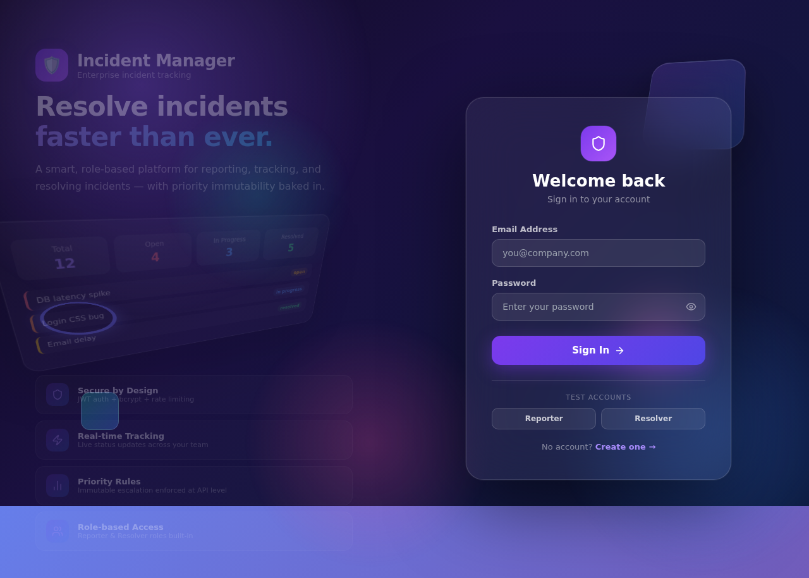
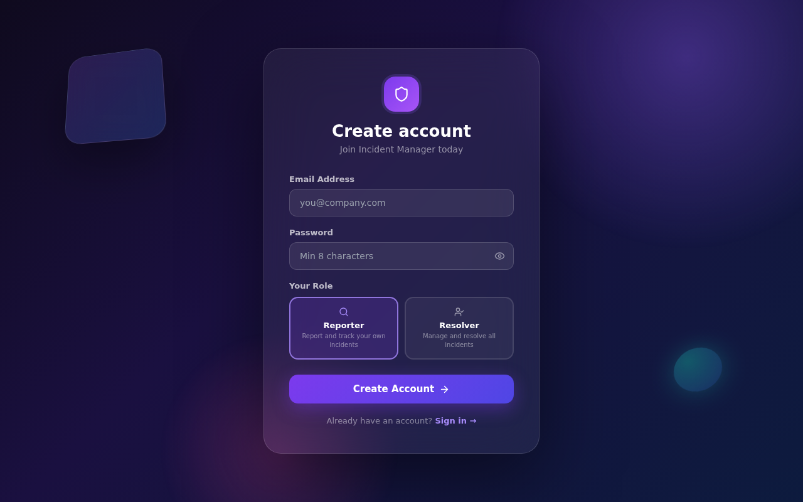
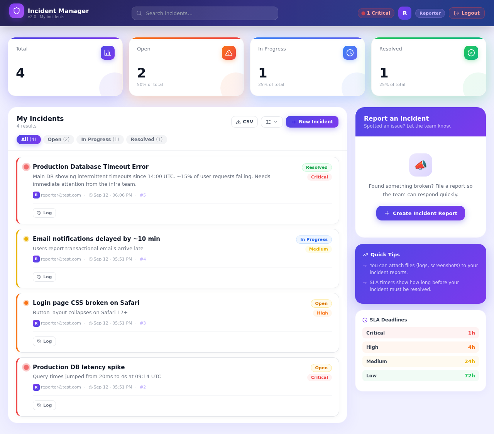
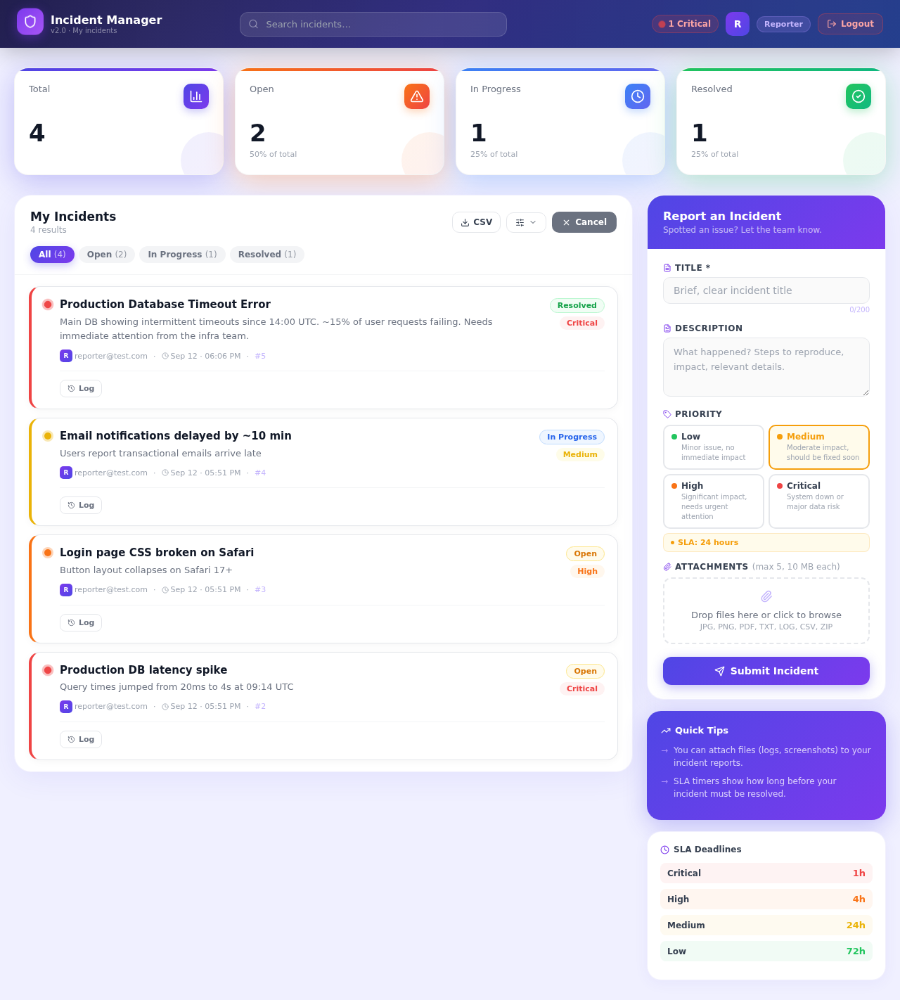
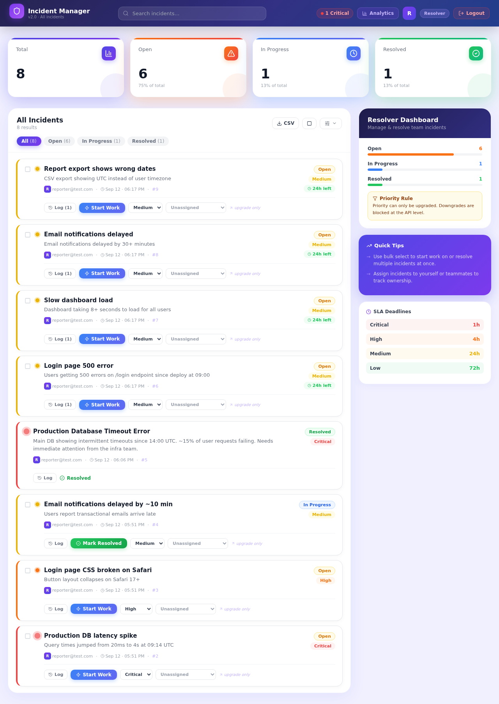
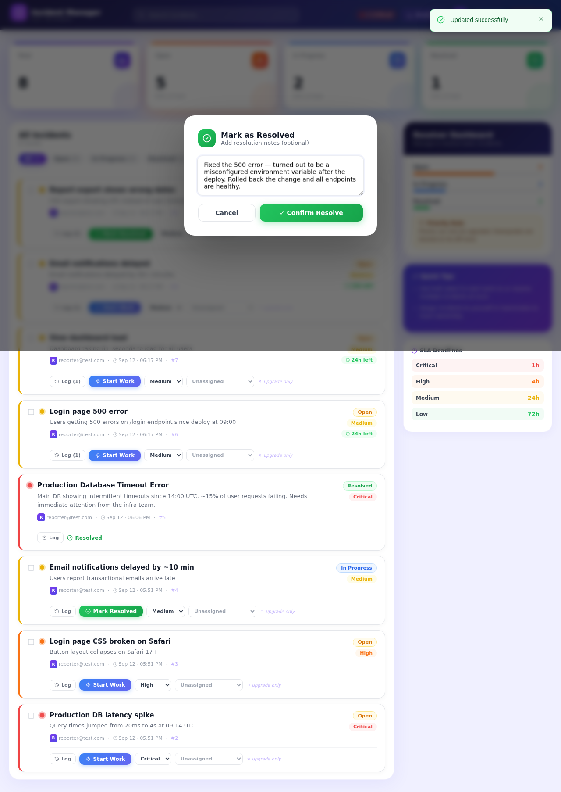
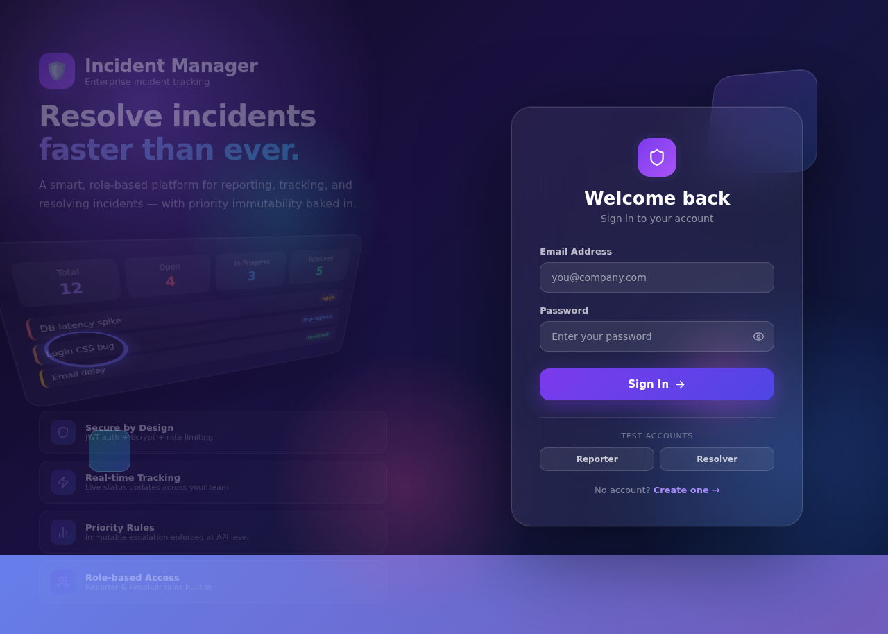
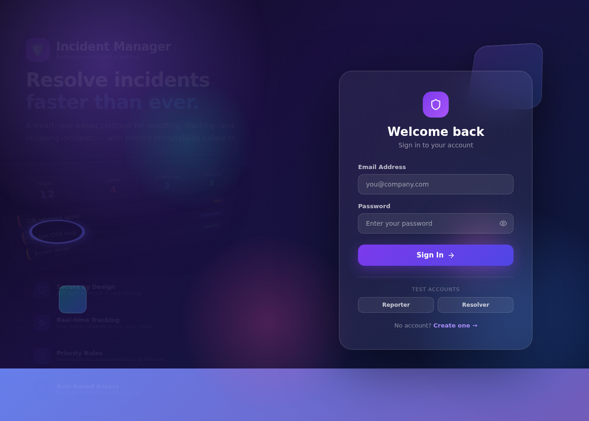

<div align="center">



# Incident Manager

**A production-ready full-stack incident reporting and resolution platform**

[](https://nodejs.org)
[](https://react.dev)
[](https://expressjs.com)
[](https://prisma.io)
[](https://sqlite.org)
[](LICENSE)

[Features](#features) · [Screenshots](#screenshots) · [Tech Stack](#tech-stack) · [Quick Start](#quick-start) · [API Reference](#api-reference) · [Deployment](#deployment)

</div>

---

## Overview

Incident Manager is a complete incident lifecycle platform built for engineering and operations teams. **Reporters** submit incidents with priority levels and file attachments. **Resolvers** triage, assign, escalate, and close them — with full audit trails, SLA tracking, and analytics.

Every incident has a clear owner, a deadline, a history, and a resolution path.

---

## Features

| Category | Capability |
|---|---|
| **Authentication** | JWT-based login & registration, bcrypt password hashing (cost 12), 7-day token expiry |
| **Role-based access** | Reporter (own incidents) · Resolver (all incidents + management) |
| **File Attachments** | Upload up to 5 files per incident (JPG, PNG, PDF, TXT, LOG, CSV, ZIP — 10 MB each) |
| **SLA Tracking** | Auto-computed deadlines per priority · Live countdown · Breach alerts |
| **Team Assignment** | Resolvers assign incidents to teammates · Email notification on assign |
| **Audit Log** | Every action recorded with actor, timestamp, and before/after values |
| **Bulk Actions** | Select multiple incidents → Start Work or Resolve All in one click |
| **Analytics** | 30-day trend chart, priority/status donuts, MTTR, top reporters, SLA breach count |
| **CSV Export** | One-click download of all incidents with full metadata |
| **Email Notifications** | Alerts on resolve, assignment, and status change (SMTP or console-log in dev) |
| **Search & Sort** | Live search + sort by newest, oldest, or priority |
| **Security** | Helmet HTTP headers, rate limiting (20 auth / 300 API per 15 min), CORS allowlist |
| **Priority Rule** | Priority can only be **upgraded** — downgrades are rejected at the API level |

---

## Screenshots

### Login & Registration

<table>
  <tr>
    <td><br/><sub><b>Login</b> — Dark aurora design with 3D floating elements</sub></td>
    <td><br/><sub><b>Register</b> — Password strength meter, visual role selector</sub></td>
  </tr>
</table>

---

### Reporter Dashboard



> Animated stat counters · Live search · Sort controls · Priority-colored incident cards with SLA timers

---

### Incident Form — with File Attachments



> Visual priority chips showing SLA deadlines · Drag-and-drop file upload zone · Character counter

---

### Resolver Dashboard — SLA Badges & Assignment


> SLA countdown badges (green → amber → red) · Assignee dropdown · Progress bars · Incident checkboxes for bulk actions

---

### Bulk Actions



> Select multiple incidents → floating action bar → Start Work or Resolve All with shared notes

---

### Resolve with Notes & Audit Log

<table>
  <tr>
    <td><br/><sub><b>Resolution Modal</b> — Add notes when closing an incident</sub></td>
    <td><br/><sub><b>Audit Log</b> — Full timeline: who did what and when</sub></td>
  </tr>
</table>

---

### Analytics Dashboard



> 30-day incident trend (SVG line chart) · Priority & status donut charts · MTTR · SLA breach count · Top reporters leaderboard

---

## Tech Stack

```
Frontend                    Backend                     Infrastructure
─────────────────────       ─────────────────────       ─────────────────────
React 19 (Vite)             Node.js 22 + Express 5      SQLite (dev)
React Router v7             Prisma ORM                  PostgreSQL (prod-ready)
Lucide React (icons)        JWT (jsonwebtoken)          Multer (file storage)
CSS animations + SVG        bcryptjs (cost 12)          Nodemailer (email)
                            Helmet + rate-limit
                            CORS allowlist
```

---

## Quick Start

### Prerequisites
- Node.js 18+

### 1. Clone the repository

```bash
git clone https://github.com/Sandeepsrinivasan-14/incident-reporting-system.git
cd incident-reporting-system
```

### 2. Set up the backend

```bash
cd backend
cp .env.example .env        # set JWT_SECRET to a long random string
npm run setup               # installs deps · generates Prisma client · seeds DB
npm run dev                 # starts on http://localhost:3001
```

### 3. Set up the frontend

```bash
cd frontend
npm install
npm run dev                 # starts on http://localhost:5173
```

The Vite dev server proxies `/api/*` → `http://localhost:3001` automatically.

### Test Accounts

| Role | Email | Password |
|---|---|---|
| Reporter | `reporter@test.com` | `password` |
| Resolver | `resolver@test.com` | `password` |

---

## Environment Variables

Create `backend/.env` (copy from `backend/.env.example`):

```env
# Required
DATABASE_URL="file:./dev.db"
JWT_SECRET="replace-with-a-secure-random-string-at-least-32-characters"
PORT=3001
NODE_ENV=development

# Optional — CORS (set in production)
FRONTEND_URL="https://your-app.vercel.app"

# Optional — Email notifications
SMTP_HOST="smtp.gmail.com"
SMTP_PORT=587
SMTP_USER="you@gmail.com"
SMTP_PASS="your-app-password"
SMTP_FROM="noreply@yourapp.com"
```

> Without SMTP config, email events are logged to the console — useful for development.

---

## SLA Reference

| Priority | Deadline | Typical Use |
|---|---|---|
| 🔴 Critical | **1 hour** | System down, data loss, security breach |
| 🟠 High | **4 hours** | Major feature broken, significant user impact |
| 🟡 Medium | **24 hours** | Degraded performance, partial outage |
| 🟢 Low | **72 hours** | Minor bug, cosmetic issue, low-traffic path |

---

## API Reference

### Authentication

| Method | Endpoint | Description |
|---|---|---|
| `POST` | `/api/register` | Register — `{ email, password, role }` |
| `POST` | `/api/login` | Login → `{ token, user }` |

### Incidents

| Method | Endpoint | Access | Description |
|---|---|---|---|
| `GET` | `/api/incidents` | Auth | List incidents (Reporter: own · Resolver: all) |
| `POST` | `/api/incidents` | Reporter | Create incident |
| `PATCH` | `/api/incidents/:id` | Resolver | Update status / priority / assignee / notes |
| `GET` | `/api/incidents/export` | Auth | Download CSV |
| `POST` | `/api/incidents/bulk` | Resolver | Bulk `resolve` or `start_work` |
| `GET` | `/api/incidents/:id/audit` | Auth | Full audit log for one incident |
| `POST` | `/api/incidents/:id/attachments` | Auth | Upload file (multipart/form-data) |
| `DELETE` | `/api/incidents/:id/attachments/:attId` | Auth | Remove attachment |

### Other

| Method | Endpoint | Access | Description |
|---|---|---|---|
| `GET` | `/api/resolvers` | Auth | List all resolver accounts |
| `GET` | `/api/analytics` | Resolver | Aggregated analytics data |
| `GET` | `/health` | Public | Server health check |

All protected endpoints require: `Authorization: Bearer <token>`

---

## Deployment

### Frontend → Vercel

1. Connect your GitHub repo to Vercel
2. Set **Root Directory** to `frontend`
3. Vercel auto-detects Vite — no extra config needed
4. Set environment variable: `VITE_API_URL` (if not using the proxy)

### Backend → Render / Railway / Fly.io

```bash
# Build command
npm run build

# Start command
npm start
```

Set these environment variables on your host:

```
DATABASE_URL=<your-postgres-or-sqlite-url>
JWT_SECRET=<your-secret>
NODE_ENV=production
FRONTEND_URL=https://your-frontend.vercel.app
```

> For production, switch Prisma datasource to PostgreSQL — update `DATABASE_URL` and `provider = "postgresql"` in `prisma/schema.prisma`.

---

## Project Structure

```
incident-reporting-system/
├── backend/
│   ├── prisma/
│   │   ├── schema.prisma          # Data models (User, Incident, Attachment, AuditLog)
│   │   └── seed.js                # Test account seed
│   ├── uploads/                   # File attachment storage
│   ├── server.js                  # Express API (all routes + middleware)
│   ├── .env.example
│   └── package.json
├── frontend/
│   ├── src/
│   │   ├── components/
│   │   │   ├── AuthContext.jsx    # JWT auth context
│   │   │   ├── Toast.jsx          # Toast notification system
│   │   │   ├── Login.jsx          # Login page
│   │   │   ├── Register.jsx       # Registration page
│   │   │   ├── Dashboard.jsx      # Main dashboard (Reporter + Resolver views)
│   │   │   ├── IncidentForm.jsx   # New incident form with file upload
│   │   │   └── Analytics.jsx      # Analytics page (Resolver only)
│   │   └── App.jsx                # Routes + providers
│   └── vite.config.js
└── docs/
    └── screenshots/               # UI screenshots
```

---

## Data Model

```
User ──< Incident (as Reporter)
User ──< Incident (as Assignee)
User ──< AuditLog

Incident ──< Attachment
Incident ──< AuditLog
```

---

## Security

- **Passwords** hashed with bcrypt (cost factor 12)
- **JWT tokens** expire after 7 days, signed with `HS256`
- **Rate limiting** — 20 requests/15 min on auth endpoints, 300/15 min on API
- **HTTP security headers** via Helmet
- **CORS** restricted to allowlisted origins
- **Input validation** on all endpoints (email format, password length, enum values)
- **Priority downgrade prevention** enforced server-side
- **File upload** restricted to safe types, 10 MB limit per file

---

## License

MIT — see [LICENSE](LICENSE) for details.
